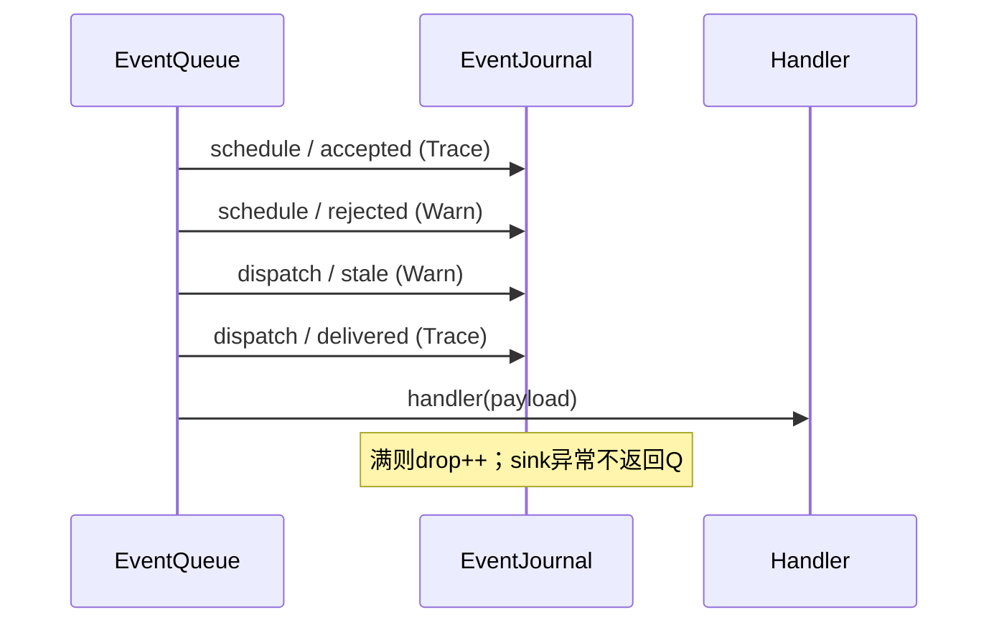

# OpenHBX 日志与可观测性设计

**版本**：V1.0  
**日期**：2026-08-30  
**Owner**：02 System/EventKernel；08 Verification 消费其公开观察结果

## 1. 先说结论

`thirdparty/ramulator2/ext/nanobind`不是日志库，而是 Python/C++ 绑定库。Ramulator2 当前的日志器只是把带级别的字符串写到`std::cerr`；实验结果则通过结构化`stats`返回，测试不会解析日志文本。OpenHBX借鉴“组件诊断与统计分离”，但不复制其固定开启Debug、无运行时过滤、无结构化字段和无日志测试的问题。

OpenHBX采用一条原则：**结构化事件是事实，文本日志和JSONL只是同一事件的不同显示方式。** 日志不能驱动模拟、不能成为正确性oracle，也不能改变event顺序、RNG、completion或stats。

## 2. Ramulator2 调研

| 项目 | Ramulator2当前实现 | OpenHBX决定 |
|---|---|---|
| `nanobind` | Python/C++ binding | 不用于日志 |
| `fmt` | 字符串格式化 | 当前不新增依赖，使用C++17标准库 |
| Logger | `debug/info/warn/error`后写`stderr` | 使用结构化`ObservedEvent`和可注入sink |
| Debug开关 | 编译期宏，logger内部debug又恒为开启 | 运行时level过滤，默认`Warn` |
| 实验oracle | 结构化stats和公式检查 | 保持snapshot/stats/event digest为oracle |
| 文件输出 | logger无artifact writer | 由08在`build/artifacts/`写JSONL，不由生产代码猜路径 |

源码依据：`thirdparty/ramulator2/src/ramulator/base/logger.{h,cpp}`、`base/debug.h`、`base/stats.h`、`python/bindings.cpp`和`tests/latency_throughput/utils/runner.py`。

## 3. 数据流与边界

```mermaid
flowchart LR
  P[生产状态变化] --> E[ObservedEvent<br/>稳定字段]
  E --> R[有界 EventJournal<br/>drop-and-count]
  R --> T[人读文本 sink]
  R --> J[JSONL artifact sink]
  E --> O[结构化 oracle / digest]
  S[snapshot + stats] --> O
  O -.不得反向驱动.->|禁止| P
```

```text
允许：生产事件 -> observer -> 文本/JSONL
禁止：解析日志文本 -> 决定模拟行为或测试是否通过
禁止：pointer、主机时间、线程调度顺序、unordered迭代顺序进入事件
```

当前实现中，`EventQueue`是第一处接入点：schedule accepted/rejected、dispatch和stale generation均从真实事件边界发布。`OpenHbxSystem`另外记录被用户callback抛出的异常。后续Host/PAL/Media只能沿用同一schema，不得各造一套logger。

## 4. 记录结构

| 字段 | 含义 | 稳定性要求 |
|---|---|---|
| `level` | Error/Warn/Info/Debug/Trace | 仅影响是否收集，不影响模型 |
| `cycle, phase, sequence` | 全局时间与确定性顺序 | sequence仅对真实queue event存在 |
| `generation` | reset fence | 必须来自System owner |
| `module, operation, stage` | 谁在做什么、做到哪一步 | 使用稳定小写名称 |
| `token` | 请求关联 | 无请求时为0并省略渲染 |
| `result` | accepted/stale/exception等 | 不使用自由变化的地址文本 |
| `resource_id` | handler/route/bank等稳定ID | 禁止对象地址 |

文本示例：

```text
level=warn cycle=12 phase=host_schedule generation=3 module=event_queue operation=schedule stage=rejected token=18 result=closed_phase resource_id=8
```

JSONL示例：

```json
{"level":"trace","cycle":14,"phase":"final_delivery","sequence":91,"generation":3,"module":"event_queue","operation":"dispatch","stage":"handler","token":18,"result":"delivered","resource_id":103}
```

## 5. 级别与输出策略

| 级别 | 用途 | 默认行为 |
|---|---|---|
| Error | callback异常、不可恢复完整性错误 | 收集 |
| Warn | rejected、stale、event丢弃、可恢复异常 | 收集 |
| Info | run/reset/drain摘要 | 默认暂未逐项接入 |
| Debug | 请求阶段和资源选择 | 显式开启 |
| Trace | 每次schedule/dispatch | 显式开启 |

`EventJournal`默认容量256、最低级别`Warn`。容量满后不覆盖首批witness，而是丢弃新事件并增加`dropped`；sink异常增加`sink_errors`并被隔离。生产库不自动创建文件。正式实验由08层把渲染结果写到：

```text
build/artifacts/<suite>/<experiment-id>/<run-id>/event-window.jsonl
```

正常结果仍以snapshot/stats及manifest为准；失败bundle还应包含`failure.json`、`outstanding.json`和`replay.sh`。

## 6. 实现映射

| 文件 | 修改内容 |
|---|---|
| `include/openhbx/system/observability.h` | schema、observer、journal、sink和snapshot公开契约 |
| `src/system/observability.cpp` | level过滤、bounded ring、drop计数、文本/JSONL确定性渲染 |
| `include/openhbx/system/event_queue.h` | 接受非拥有型`EventObserver` |
| `src/system/event_queue.cpp` | 从真实schedule/dispatch边界发布事件 |
| `include/openhbx/system/open_hbx_system.h` | 拥有journal并提供只读snapshot/sink配置 |
| `src/system/open_hbx_system.cpp` | 连接EventQueue并记录callback exception |
| `tests/unit/system/test_event_kernel.cpp` | 检查字段、顺序、过滤、drop和两种renderer |

生命周期：



## 7. 测试和精简原则

新增测试必须使用始终执行的`CHECK/REQUIRE`，不能把有副作用的调用放进`std::assert`。日志开启/关闭的系统级确定性对比、artifact writer和失败自动event window仍属于后续08实施项。

本次审计未发现可安全删除的生产assert：唯一`static_assert`保护strong ID契约，应保留。现有测试的大量`std::assert`不是冗余，而是Release下会消失的oracle，应另行整体迁移；只有证明重复、不可达或被公开前置条件严格覆盖，并有测试证明行为不弱化时才能删除。

## 8. 必要总结

1. 不引入`nanobind`，也不照搬Ramulator2的薄logger。
2. OpenHBX先建立确定性的结构化事件，再从同一事件渲染人读日志和JSONL。
3. 默认只保留Warn/Error，逐事件Trace必须显式开启且受容量限制。
4. 日志永远不是oracle；snapshot、stats、event digest和manifest才是正式证据。
5. 本阶段完成EventQueue与callback异常的最小闭环，其他模块按相同schema渐进接入。
